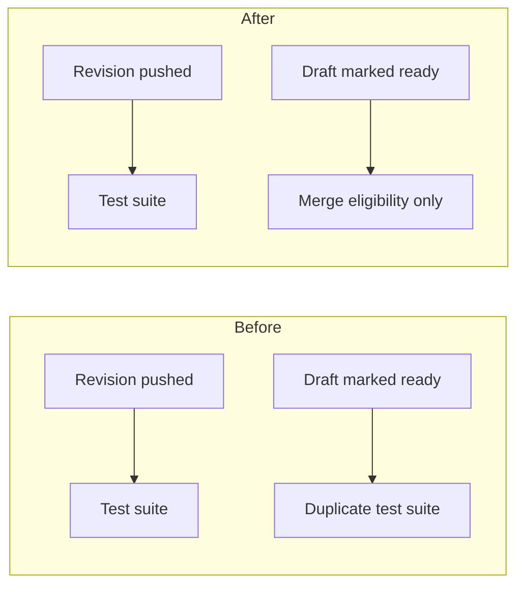

# Description examples

These illustrative descriptions show how to keep conclusions visible while disclosing longer
evidence. Use the consumer's actual headings, policy links, issue relationships, and run evidence.
Do not copy a claim or figure unless the current change supports it.

## Small behavior fix

```markdown
## Summary

Reopening the review dialog now cancels its pending reset. Previously, the reset cleared the
new selection because the timer outlived the closed state.

## Impact

Staff can close and reopen a review without losing the new selection. Closing normally still
clears the old selection after the exit animation.
```

No diagram, cost calculation, database inventory, or local successful-test list is needed.

## Database relationship change

```markdown
## Summary

Recovery attempts now reference retained account identities through a foreign key. Previously,
an unvalidated identifier could refer to an account that no longer existed.

## Impact

Operators can trace each attempt to a retained identity, and deletion cannot orphan recovery
history. The API's recovery response is unchanged. Storage cost is unmeasured; retaining an
identity row per deleted account adds storage proportional to account deletions.

<details>
<summary>Schema inventory and conformance</summary>

| Object                                        | Before                  | After                             |
| --------------------------------------------- | ----------------------- | --------------------------------- |
| `account_identity` table                      | Absent                  | Retains each account's identity   |
| `recovery_attempt.account_id` column          | Unvalidated UUID        | Removed                           |
| `recovery_attempt.account_identity_id` column | Absent                  | Required foreign key              |
| Foreign-key constraint                        | Absent                  | References `account_identity(id)` |
| Lookup index                                  | Uses the removed column | Uses `account_identity_id`        |

The relationship uses a typed column and concrete foreign key, as required by the repository's
relational-storage policy. The current schema, recovery writer, account-deletion path, and
operator query change together. There is no dual reader or writer.

</details>
```

In a real description, link the consumer's policy and implementation evidence. Do not prescribe
this consumer-specific retention or deployment policy for other repositories.

## Workflow and cost change

````markdown
## Summary

Test jobs now run once per revision. Previously, changing a pull request's draft status started
a duplicate test run even though no test job consumed draft state.

## Impact

Contributors keep the checks already attached to their revision when marking it ready. Estimated
runner use falls by one duplicate suite per draft-to-ready transition; the estimate assumes
one transition and a 12-minute suite. Aggregate savings are unmeasured.

<details>
<summary>Before and after event flow</summary>



</details>
````

The diagram explains event ownership; a file list or arrows between the Summary and Impact sections
would not clarify the behavior. Link the run measurements supporting a real estimate.

## Harness gap: omitted local verification

```markdown
## Harness gaps

CI found that the local pre-push command omitted the compiler-contract suite. The harness now
includes that suite, and the missing public export is fixed.

<details>
<summary>Failure and durable correction</summary>

The failed compiler-contract job on the first pushed revision reported the missing export.
The pre-push record ran the component project only; the compiler-contract project was omitted
because the command catalog did not include it. The catalog and pre-push selection now include
the project, and a public-import regression covers this export.

</details>
```

The actual record must link the failing run/job and exact head SHA, plus the local scope and
correction evidence. Retain it when the corrected revision passes CI.

## Harness gap: passed locally, failed in CI

```markdown
## Harness gaps

The contract suite passed locally but failed in CI because the local runner selected the host
architecture instead of the deployment target. Local validation now selects that target explicitly.

<details>
<summary>Local and CI scope difference</summary>

The pre-push record and failing job used the same suite on the same revision. Their target
configurations differed: local selected the host target, while CI compiled the deployment target.
The local command now uses the deployment target, and a compiler regression covers the rejected
cross-target import. This was a configuration mismatch, not an omitted suite.

</details>
```

Link the concrete revision, failed job, local evidence, and correction in the actual record.
An external service outage, unavailable CI-only credentials, or unknown local execution history
does not support this claim. Explain such limitations separately when they affect the outcome.
